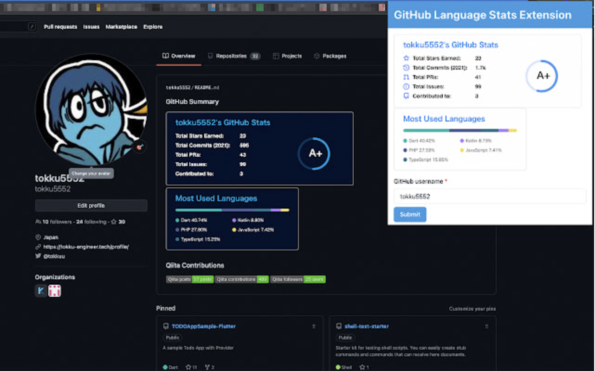

# GitHub Language Extension

GitHub Language Stats Extension(Chrome Extension)



## Prerequisites

- versions

| runtime |version|
|--|---|
|node|v18.12.1|
|npm|8.19.2|
|yarn|1.22.19|


## Option

* [Visual Studio Code](https://code.visualstudio.com/)

## Setup

```bash:
yarn install
```

## Build

```bash:
yarn build
```

## Build in watch mode


```bash:
yarn watch
```

## Load extension to chrome

Load `dist` directory

## Test
`npx jest` or `yarn test`
