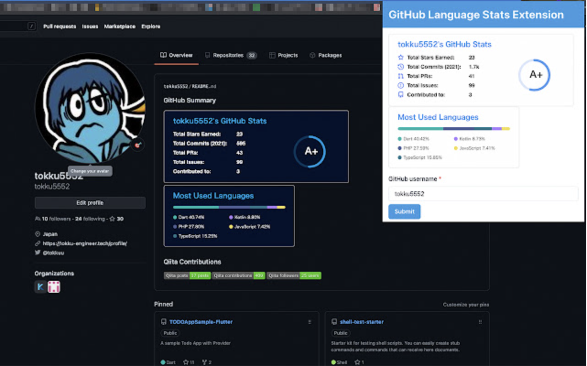

# GitHub Language Extension

GitHub Language Stats Extension(Chrome Extension)



## Prerequisites

- versions

| runtime |version|
|--|---|
|node|v18.12.1|
|npm|8.19.2|
|yarn|1.22.19|

## Option

- [Visual Studio Code](https://code.visualstudio.com/)

## Setup

```bash:
yarn install
```

## Build

```bash:
yarn build
```

## Build in watch mode

```bash:
yarn watch
```

- delete webpack cache

```bash:
yarn cache clean
```

## GitHub personal access token (optional)

The extension reads stats straight from the GitHub API. Without a token it uses
the anonymous REST API, which is limited to 60 requests per hour per IP address
and cannot report commits, PRs, issues, rank or private contributions.

Saving a token on the extension's options page switches it to the GraphQL API,
which raises the limit to 5,000 requests per hour and restores the full card. A
classic token needs no scopes for public data; add `repo` to include private
contributions. The token is stored in `chrome.storage.local` and is only ever
sent to `api.github.com`.

## Load extension to chrome

Load `dist` directory

## Test

`npx jest` or `yarn test`
